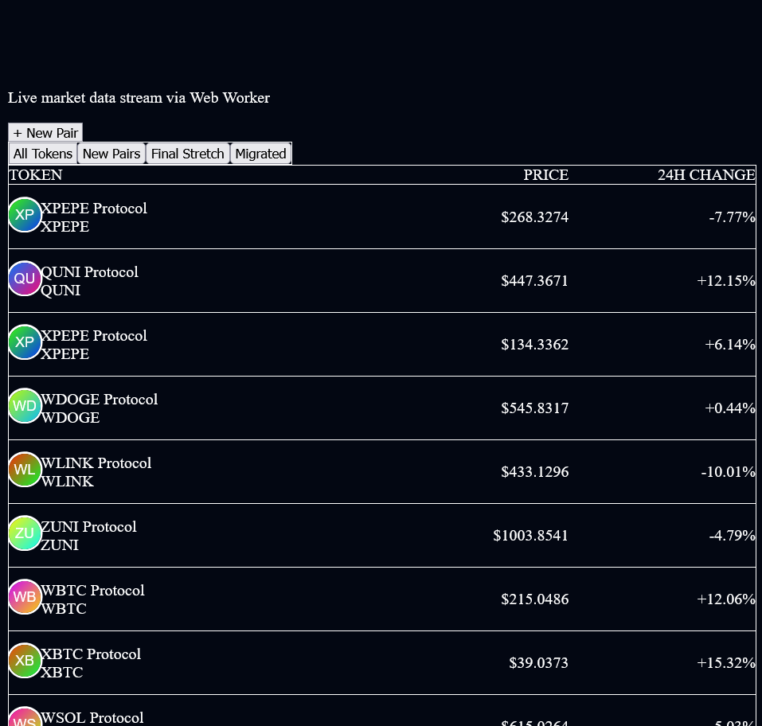
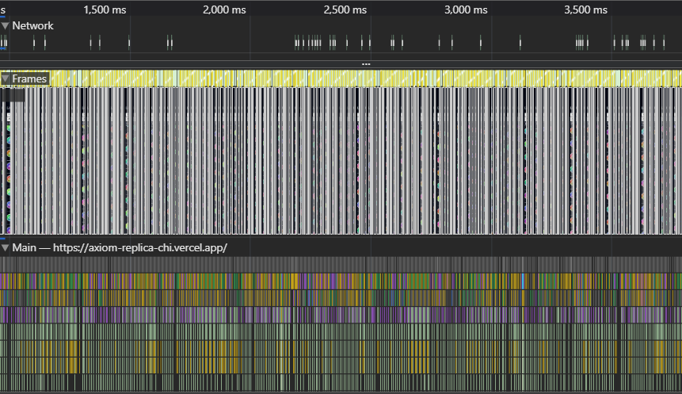
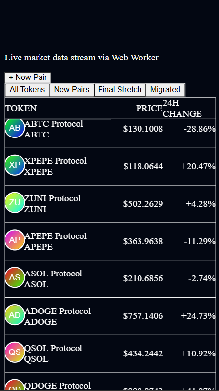

# Axiom Trade - High Frequency Discovery Table

A pixel-perfect, high-performance replica of the Axiom Trade token discovery interface. Built to handle high-frequency data updates (60fps) without blocking the main thread.

Live Demo: [https://axiom-replica-ln0dlspvs-amritanshs-projects-ca6f310d.vercel.app]



## Architectural Decisions

1. The "Off-Main-Thread" Engine (Web Workers)
Instead of cluttering the React Event Loop with WebSocket parsing, I moved the data ingestion to a **Web Worker** (`src/lib/workers/socket.worker.ts`).
* **Why:** Parsing thousands of JSON objects freezes the UI.
* **Result:** The UI remains responsive (60fps scroll) even when receiving 100+ updates per second.

### 2. Market Simulation (Markov Chains)
To meet the "Real-time updates" requirement without a paid API, I built a **Stochastic Market Simulator**.
* It doesn't just randomize numbers; it uses a **Regime-Switching Model** (Bull/Bear/Sideways).
* Tokens exhibit "Trending" behavior via a simplified **Markov Chain**, making the data feel organic rather than chaotic.

### 3. O(1) State Management
I utilized **Redux Toolkit's Entity Adapter** to normalize state.
* Looking up a token by ID is O(1).
* Updates are batched to match the browser's frame budget (16ms).

### 4. Virtualization
Implemented `tanstack-virtual` to render only the visible viewport (~15 rows) while maintaining the scroll physics of a 1,000-row table.

## Tech Stack

* **Framework:** Next.js 14 (App Router)
* **Language:** TypeScript (Strict Mode)
* **State:** Redux Toolkit + React Query
* **Styling:** Tailwind CSS + Radix UI (Dialogs)
* **Performance:** Web Workers + Virtualization

## Snapshots

### Performance Profiling
*Zero layout shifts during data updates.*


### Mobile Responsive
*Fully accessible layout down to 320px.*


##  Running Locally

```bash
npm install
npm run dev